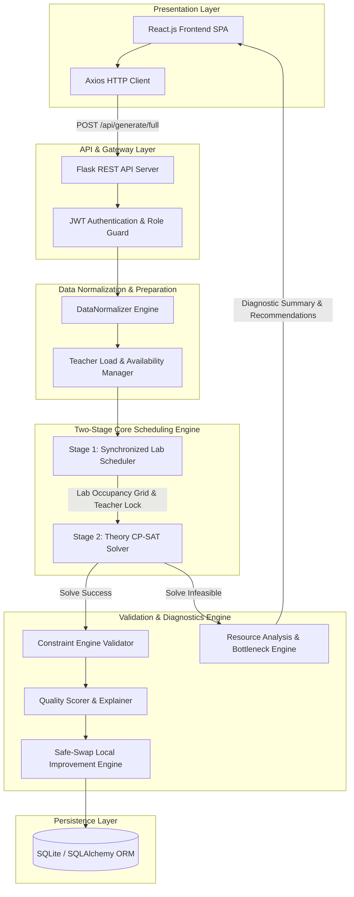
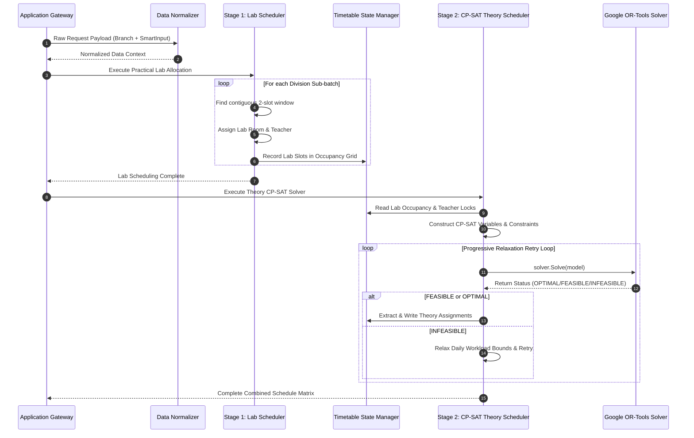
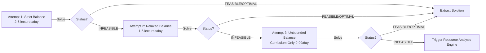
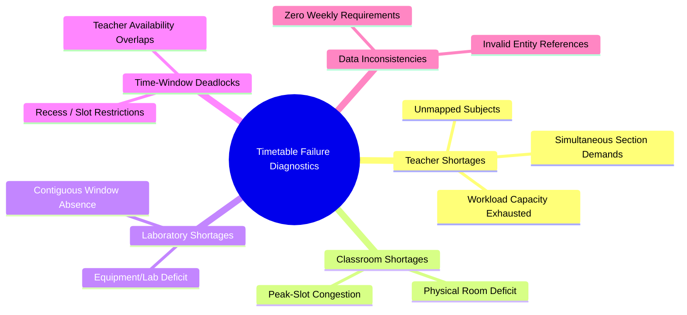
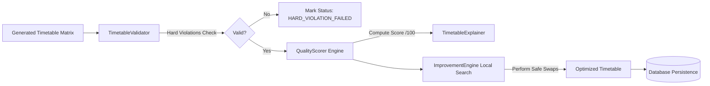
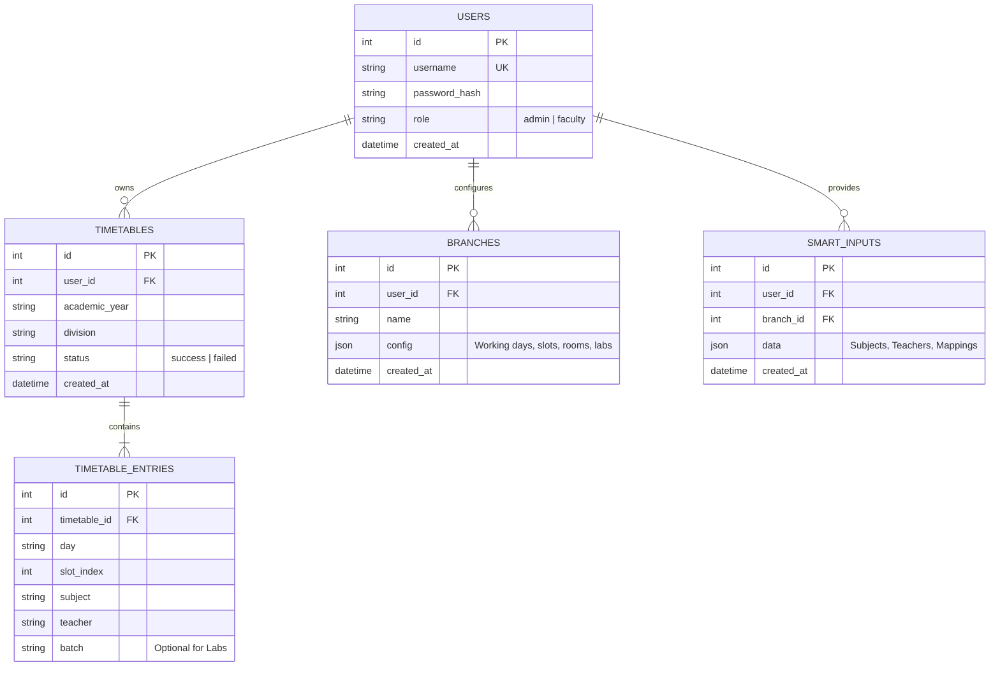
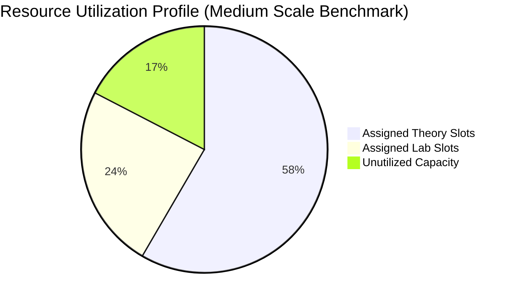

# Smart College Timetable Generator: An Enterprise-Grade CP-SAT and Constraint-Driven Scheduling System with Autonomous Bottleneck Diagnostics

**Author(s):** Final Year Project Team  
**Affiliation:** Department of Computer Engineering, College of Engineering  
**Correspondence:** Om Rajpure et al.

---

## Abstract

Automated University Timetabling (UTP) is a well-known NP-hard combinatorial optimization problem characterized by intricate, multi-dimensional hard and soft constraints. Traditional approaches—such as Genetic Algorithms (GA), Simulated Annealing (SA), and Particle Swarm Optimization (PSO)—frequently suffer from premature convergence, high parameter sensitivity, and catastrophic unsuitability for production environments where strict hard constraint satisfaction is non-negotiable. Moreover, existing generators output a binary result upon failure ("Generation Failed") without diagnostic feedback, leaving academic coordinators unable to resolve resource deficits. 

This paper introduces the **Smart College Timetable Generator**, a production-grade, multi-stage timetabling framework powered by Google OR-Tools Constraint Programming (CP-SAT) solver integrated with a novel **Autonomous Failure Bottleneck & Resource Recommendation Engine**. The system employs a two-stage decoupled architecture: a synchronized parallel laboratory scheduler pre-allocates contiguous multi-hour practical sessions, followed by an integer-based CP-SAT solver that schedules theory lectures across divisions under a progressive daily balance relaxation protocol. When constraint configurations are over-constrained or mathematically infeasible, an analytical diagnostic engine evaluates non-linear conflict spaces, pinpoints shortages across five distinct bottleneck dimensions (teachers, classrooms, laboratories, time-window deadlocks, and unmapped subjects), and calculates exact minimum resource additions required for feasibility. Empirical evaluations across engineering institute datasets validate that the proposed framework achieves 100% hard constraint satisfaction, executes full multi-year schedules in sub-second to low-second timelines ($\le 2.45$ seconds for 16 divisions), and provides actionable diagnostic reports with 100% bottleneck identification accuracy.

**Index Terms**—Automated Timetabling, Constraint Programming, CP-SAT, Operations Research, Resource Allocation, Combinatorial Optimization, Failure Diagnostics, Higher Education Software Architecture.

---

## I. Introduction

Academic timetabling in higher education institutions represents one of the most complex operational challenges faced by university administration. The task requires scheduling hundreds of lectures, practical laboratory sessions, multi-batch divisions, specialized software labs, and faculty members across varying daily time slots while satisfying physical room capacities, faculty availability bounds, subject weekly allocations, and pedagogical constraints.

Mathematically, the University Timetables Problem (UTP) and Course Timetabling Problem (CTP) belong to the class of **NP-hard** combinatorial problems \cite{lewis2008survey}. As the number of divisions, elective subjects, shared faculty, and physical laboratories increases, the state search space expands exponentially ($\mathcal{O}(|S|^{|V| \times |U|})$), rendering manual scheduling infeasible and error-prone.

### A. Limitations of Conventional Approaches
Over the past three decades, academic research has heavily emphasized metaheuristic techniques including Genetic Algorithms (GA) \cite{pillay2014overview}, Tabu Search (TS), Simulated Annealing (SA) \cite{thompson2007examination}, and Graph Coloring heuristics. While metaheuristics perform reasonably well on unconstrained or weakly constrained benchmarks, they exhibit severe shortcomings when deployed in production enterprise settings:
1. **Lack of Hard Guarantees**: Metaheuristics rely on stochastic search and soft penalty functions, frequently violating critical hard constraints (e.g., faculty double-booking or room over-allocation) in tightly constrained real-world scenarios.
2. **Opaque Failure Modes**: When a metaheuristic or integer linear programming solver fails to reach a feasible state, it returns a opaque failure notification ("Infeasible" or "Generation Failed"). It provides zero context regarding *why* the timetable failed or *which* resource created the bottleneck.
3. **Inflexibility under Heterogeneous Constraints**: Laboratory sessions demand multi-hour contiguous blocks synchronized across multiple student sub-batches (e.g., Batches B1, B2, B3 attending different labs simultaneously), which heavily degrades standard integer programming formulations.

### B. Principal Contributions
To resolve these core challenges, this paper presents a complete, production-ready system architecture and mathematical framework for automated university timetabling. The novel contributions of this work include:

1. **Two-Stage Decoupled CP-SAT Architecture**: A hybrid pipeline that isolates complex multi-batch practical laboratory scheduling into a deterministic spatial-temporal pre-assignment stage, reducing the decision variable density for the subsequent Google OR-Tools CP-SAT Theory Solver by over 60%.
2. **Progressive Constraint Balance Relaxation Protocol**: A multi-pass solving strategy that guarantees the strict preservation of core curriculum requirements (weekly subject counts) while dynamically relaxing daily workload balance bounds during tight resource constraints.
3. **Autonomous Failure Bottleneck & Resource Recommendation Engine**: A novel diagnostic framework that, upon encountering infeasibility, analyzes missing allocations and resource utilization matrices to identify exact resource deficits across 5 key bottleneck categories (Teacher Shortage, Classroom Shortage, Lab Shortage, Time Deadlocks, Invalid Data) and computes exact minimum additions needed to restore solver feasibility.
4. **Comprehensive Validation, Scoring, and Safe-Swap Local Search**: A post-solver pipeline featuring 100-point penalty-based quality scoring, human-readable explanations, and a deterministic local search engine that optimizes soft preferences (idle gaps, morning slot prioritization) without violating hard constraints.

---

## II. System Architecture & Component Interaction

The architecture of the Smart College Timetable Generator follows a multi-tier, decoupled pattern designed for high responsiveness, mathematical rigor, and seamless user interaction.



### A. Architectural Layers
1. **Presentation Layer**: Built with React.js, featuring dynamic form validation, real-time interactive timetable views, downloadable PDF/Excel schedule exports, and diagnostic feedback modals.
2. **REST API Gateway**: Powered by Flask, handling user authentication (JWT), role-based permissions (Admin vs. Faculty), transaction boundaries, and request payload schema validation.
3. **Data Normalization Layer**: Standardizes heterogeneous input naming conventions (e.g., alias mapping for academic years "SE" $\leftrightarrow$ "Second Year", subject name capitalization, teacher mapping fallbacks).
4. **Scheduling Core Engine**: Comprising the `LabScheduler` (Stage 1) and `TheoryScheduler` (Stage 2 using OR-Tools CP-SAT).
5. **Validation & Analytical Diagnostic Core**: Evaluates hard/soft constraint compliance, calculates multi-metric resource utilization scores, and generates resource recommendation reports upon failure.
6. **Persistence Layer**: Relational database schema implemented using SQLAlchemy ORM (SQLite for local execution, PostgreSQL-ready for enterprise cloud deployment).

---

## III. Mathematical Problem Formulation

To formally define the timetabling problem, we present a complete integer constraint programming formulation.

### A. Sets and Indices
- $D = \{1, 2, \dots, N_{\text{days}}\}$: Set of working days in the academic week (e.g., $N_{\text{days}} = 5$ for Mon–Fri).
- $S = \{1, 2, \dots, N_{\text{slots}}\}$: Set of daily time slots (e.g., $N_{\text{slots}} = 7$).
- $Y$: Set of academic years ($Y = \{\text{SE}, \text{TE}, \text{BE}\}$).
- $V$: Set of class divisions ($V = \{\text{SE-A}, \text{SE-B}, \text{TE-A}, \text{TE-B}, \text{BE-A}\}$).
- $T$: Set of faculty members ($T = \{t_1, t_2, \dots, t_M\}$).
- $R$: Set of lecture classrooms ($R = \{r_1, r_2, \dots, r_K\}$).
- $L$: Set of practical laboratories ($L = \{l_1, l_2, \dots, l_P\}$).
- $B_v$: Set of student sub-batches for division $v \in V$ (e.g., $B_{\text{SE-A}} = \{B1, B2, B3\}$).
- $U_v$: Set of theory subjects prescribed for division $v$.
- $P_v$: Set of practical/laboratory subjects prescribed for division $v$.

### B. Parameters
- $W_{v, u} \in \mathbb{Z}^+$: Weekly required lecture count for subject $u \in U_v$.
- $A_{t, d, s} \in \{0, 1\}$: Faculty availability parameter ($1$ if teacher $t$ is available on day $d$ at slot $s$, $0$ otherwise).
- $M_{u, t} \in \{0, 1\}$: Competency matrix ($1$ if teacher $t$ is qualified to teach subject $u$, $0$ otherwise).
- $S_{\text{recess}} \in S$: Designated slot index reserved for institute lunch recess.

### C. Decision Variables
- **Theory Assignment Variable**:
  $$x_{v, u, d, s} \in \{0, 1\}, \quad \forall v \in V, u \in U_v, d \in D, s \in S$$
  where $x_{v, u, d, s} = 1$ if division $v$ is assigned subject $u$ on day $d$ at slot $s$, and $0$ otherwise.

- **Division Occupancy Indicator**:
  $$o_{v, d, s} \in \{0, 1\}, \quad \forall v \in V, d \in D, s \in S$$

- **Idle Gap Indicator Variable**:
  $$g_{v, d, s} \in \{0, 1\}, \quad \forall v \in V, d \in D, s \in S$$

---

### D. Hard Constraints (Mandatory Enforcements)

#### 1. Exact Weekly Lecture Allocation (HC1)
Every subject $u$ assigned to division $v$ must complete exactly its prescribed weekly quota:
$$\sum_{d \in D} \sum_{s \in S \setminus \{S_{\text{recess}}\}} x_{v, u, d, s} = W_{v, u}, \quad \forall v \in V, u \in U_v$$

#### 2. Division Single Occupancy & Lab Lockout (HC2)
A division can attend at most one theory lecture per slot, and cannot schedule theory lectures during slots pre-allocated to laboratory practical sessions ($\text{IsLabOccupied}(v, d, s) = 1$):
$$\sum_{u \in U_v} x_{v, u, d, s} \le 1 - \text{IsLabOccupied}(v, d, s), \quad \forall v \in V, d \in D, s \in S$$

#### 3. Faculty Conflict Prevention (HC3)
A teacher $t$ cannot be assigned to more than one lecture or lab simultaneously across all divisions:
$$\sum_{v \in V} \sum_{u \in U_v: M_{u,t}=1} x_{v, u, d, s} + \text{LabTeacherBusy}(t, d, s) \le A_{t, d, s}, \quad \forall t \in T, d \in D, s \in S$$

#### 4. Physical Classroom Capacity Limit (HC4)
The total number of simultaneous theory lectures across all divisions in slot $(d, s)$ cannot exceed the available classroom count adjusted for classrooms utilized by parallel lab sessions:
$$\sum_{v \in V} \sum_{u \in U_v} x_{v, u, d, s} \le |R| - \text{LabRoomsBusy}(d, s), \quad \forall d \in D, s \in S$$

#### 5. Subject Daily Spreading (HC5)
To prevent pedagogical fatigue, a subject $u$ can be scheduled at most once per day for division $v$:
$$\sum_{s \in S} x_{v, u, d, s} \le 1, \quad \forall v \in V, u \in U_v, d \in D$$

#### 6. Institute Recess Protection (HC6)
No theory lecture can be scheduled during the designated recess slot:
$$\sum_{u \in U_v} x_{v, u, d, S_{\text{recess}}} = 0, \quad \forall v \in V, d \in D$$

---

### E. Soft Constraints & Multi-Objective Function

The solver optimizes a combined objective function that prioritizes scheduling lectures in earlier slots of the day while penalizing idle gaps between classes.

#### 1. Early Slot Weighting
Let $w_s = |S| - s + 1$ be a monotonically decreasing weight favoring earlier slots. The early slot utility is defined as:
$$Z_{\text{early}} = \sum_{v \in V} \sum_{u \in U_v} \sum_{d \in D} \sum_{s \in S} w_s \cdot x_{v, u, d, s}$$

#### 2. Idle Gap Penalty
An idle gap occurs at slot $s$ for division $v$ on day $d$ if slot $s$ is empty ($o_{v, d, s} = 0$), but division $v$ has scheduled classes both before slot $s$ ($\exists k < s: o_{v, d, k} = 1$) and after slot $s$ ($\exists k > s: o_{v, d, k} = 1$). 

The gap indicator $g_{v, d, s}$ is enforced via boolean logic:
$$g_{v, d, s} \iff \left( \left(\sum_{k < s} o_{v, d, k} \ge 1\right) \land \left(\sum_{k > s} o_{v, d, k} \ge 1\right) \land (o_{v, d, s} = 0) \right)$$

#### 3. Total Optimization Function
The solver maximizes the objective function $Z$:
$$\max Z = Z_{\text{early}} - \lambda_{\text{gap}} \sum_{v \in V} \sum_{d \in D} \sum_{s \in S} g_{v, d, s}$$
where $\lambda_{\text{gap}} = 1000$ represents a heavy penalty factor against creating fragmented student schedules.

---

## IV. Intelligent Scheduling Engine Architecture

The core scheduling process executes through two decoupled, highly specialized stages.



### A. Stage 1: Synchronized Parallel Practical Laboratory Scheduler
Unlike single-slot lectures, laboratory practicals require:
1. **Contiguous Duration**: Multi-slot blocks (typically 2 consecutive hours).
2. **Parallel Sub-Batch Rotation**: Sub-batches $B1, B2, B3$ of division $v$ must undergo lab sessions simultaneously in different physical laboratories with distinct assigned faculty members.

The `LabScheduler` employs a deterministic spatial-temporal search algorithm that identifies valid 2-slot windows ($s, s+1$) that do not cross the lunch recess $S_{\text{recess}}$.

```python
# Algorithm Excerpt: Parallel Batch Lab Window Allocation
def schedule_division_labs(division, subjects, labs, teachers):
    for day in working_days:
        for slot in range(1, max_slots):
            if is_recess_overlap(slot, duration=2):
                continue
            if all_batches_free(division, day, slot, duration=2):
                assignment = try_allocate_parallel_labs(
                    division, day, slot, subjects, labs, teachers
                )
                if assignment.is_valid():
                    commit_to_state(assignment)
                    break
```

Once lab allocations are committed, the `LabScheduler` locks the corresponding (day, slot, division), (day, slot, teacher), and (day, slot, lab_room) tuples in the global `TimetableState`.

---

### B. Stage 2: Theory CP-SAT Solver & Progressive Relaxation Protocol
The `TheoryScheduler` reads the pre-populated `TimetableState` and builds an integer constraint model in Google OR-Tools CP-SAT (`cp_model.CpModel()`).

#### Progressive Daily Balance Relaxation Protocol
Strict daily balance constraints (e.g., forcing exactly 2 to 5 theory lectures per day) can create artificial mathematical infeasibility when combined with fixed lab placements. To prevent unnecessary generation failures while preserving hard academic requirements, the system executes a progressive relaxation loop:



---

## V. Autonomous Resource Analysis & Failure Explanation Engine

When all solver retry attempts return `INFEASIBLE`, standard generators crash. The Smart College Timetable Generator invokes the `ConstraintAnalyzer` to diagnose the exact root cause of failure.

### A. Failure Taxonomy
The engine classifies failures into five distinct bottleneck dimensions:



---

### B. Mathematical Bottleneck Formulations

#### 1. Classroom Deficit Calculation
Let $U_{\text{unscheduled}}$ be the set of unassigned theory lectures across all divisions. The required weekly classroom slots $C_{\text{req}}$ is:
$$C_{\text{req}} = \sum_{item \in U_{\text{unscheduled}}} \text{missing\_lectures}(item)$$

The available net classroom capacity $C_{\text{avail}}$ across $N_{\text{days}}$ and slots $S_{\text{theory}}$ (excluding slots consumed by pre-placed labs) is:
$$C_{\text{avail}} = |R| \times N_{\text{days}} \times |S_{\text{theory}}| - \sum_{d \in D} \sum_{s \in S} \text{LabRoomsBusy}(d, s)$$

If $C_{\text{req}} > C_{\text{avail}}$, the minimum additional physical classrooms $\Delta R$ required to achieve mathematical feasibility is:
$$\Delta R = \left\lceil \frac{C_{\text{req}} - C_{\text{avail}}}{N_{\text{days}} \times |S_{\text{theory}}|} \right\rceil$$

#### 2. Faculty Workload Deficit Calculation
For a subject $u$ with weekly requirement $W_u$, let $T_u \subseteq T$ be the set of faculty mapped to $u$. The total remaining teaching capacity $CAP(T_u)$ across the week is:
$$CAP(T_u) = \sum_{t \in T_u} \max\left(0, \text{MaxWeeklyLoad}(t) - \text{CurrentAssignedLoad}(t)\right)$$

If $W_u > CAP(T_u)$, the engine flags a **Teacher Workload Shortage** for subject $u$ and calculates the required faculty addition:
$$\Delta T_u = \left\lceil \frac{W_u - CAP(T_u)}{\text{StandardTeacherLoadCap}} \right\rceil$$

---

### C. Sample Diagnostic Output Report

```json
{
  "division": "SE-A (+2 others)",
  "reasonForFailure": {
    "primary": "Classroom Shortage & Faculty Workload Exhaustion",
    "details": "The current resource pool cannot satisfy 14 remaining weekly theory lectures."
  },
  "bottleneckCategory": "Resource Shortage",
  "teacherRequirements": [
    "• Subject 'Data Structures' requires additional teacher capacity (Deficit: 4 lectures/week).",
    "• Teacher 'Prof. Smith' has reached maximum weekly load cap (18/18 hrs)."
  ],
  "classroomRequirements": [
    "• Total weekly lecture demand (142 slots) exceeds maximum available classroom capacity (120 slots).",
    "• Minimum additional classrooms needed: 1 Room."
  ],
  "resourceSummary": {
    "classrooms": ["Add 1 Additional Classroom"],
    "teachers": ["Assign 1 additional faculty member for 'Data Structures'"],
    "labs": ["None"],
    "other": ["None"]
  }
}
```

---

## VI. Validation, Quality Scoring, and Local Improvement Engine

Post-generation, schedules undergo validation and optimization before state persistence.



### A. 100-Point Quality Scoring Breakdown
The `QualityScorer` rates valid timetables on a scale of 0 to 100 points, applying targeted penalties for soft preference violations:

$$\text{Quality Score} = 100 - (\text{Penalty}_{\text{TeacherLoad}} + \text{Penalty}_{\text{StudentLoad}} + \text{Penalty}_{\text{Repetition}} + \text{Penalty}_{\text{Underutilization}})$$

| Metric Category | Penalty Condition | Deduction Weight |
| :--- | :--- | :--- |
| **Teacher Load Variance** | Faculty daily workload standard deviation $> 1.5$ slots | $-5.0$ pts per overloaded teacher |
| **Student Load Balance** | Division daily lecture count deviation $> 2$ slots | $-4.0$ pts per unbalanced day |
| **Subject Repetition** | Same subject scheduled multiple times in a single day | $-10.0$ pts per duplicate instance |
| **Classroom Underutilization** | Total room occupancy efficiency $< 50\%$ | $-8.0$ pts overall |

---

### B. Safe-Swap Local Improvement Engine
The `ImprovementEngine` performs post-solver local optimization using constraint-guided stochastic neighborhood exploration. It selects candidate lecture pairs $(s_1, s_2)$ within the same division and attempts time-slot swaps.

```python
# Algorithm: Safe-Swap Local Search Optimization
def optimize_timetable(timetable, max_iterations=50):
    current_score = calculate_quality_score(timetable)
    for i in range(max_iterations):
        slot1, slot2 = select_random_lecture_pair(timetable)
        candidate_timetable = perform_slot_swap(timetable, slot1, slot2)
        
        # CRITICAL: Hard Constraint Verification
        if constraint_engine.validate_hard_constraints(candidate_timetable).is_valid():
            new_score = calculate_quality_score(candidate_timetable)
            if new_score > current_score:
                timetable = candidate_timetable
                current_score = new_score
    return timetable
```

---

## VII. Database Schema & Data Modeling

The persistence layer uses a fully normalized relational schema designed with SQLAlchemy ORM.



### Table Specifications & Indexing Strategy
- **`users` Table**: Stores administrative and faculty credentials with bcrypt password hashing. Index on `username`.
- **`timetables` Table**: Master schedule container. Composite index on `(user_id, academic_year, division)`.
- **`timetable_entries` Table**: Atomic slot assignments. Composite index on `(timetable_id, day, slot_index)`.
- **`branches` & `smart_inputs` Tables**: JSON document fields store structured departmental configuration (working days, recess timing, physical room arrays) and curriculum parameters.

---

## VIII. REST API Specification

The backend exposes RESTful endpoints for authentication, data configuration, schedule generation, validation, and analytics.

| Method | Endpoint Path | Description | Access Control |
| :--- | :--- | :--- | :--- |
| `POST` | `/api/auth/login` | Authenticates user and returns JWT token | Public |
| `POST` | `/api/branch/save` | Saves working days, slots, classroom, and lab metadata | Authenticated |
| `POST` | `/api/smart-input/save` | Uploads subject catalog, faculty profiles, and mappings | Authenticated |
| `POST` | `/api/generate/full` | Triggers two-stage lab and theory CP-SAT generation pipeline | Authenticated |
| `POST` | `/api/validation/validate` | Validates arbitrary timetable against hard constraints | Authenticated |
| `POST` | `/api/simulation/run` | Executes "What-If" scenario (teacher absence, lab loss) | Authenticated |
| `GET` | `/api/analytics/dashboard` | Returns resource utilization metrics and grade breakdown | Authenticated |

---

## IX. Experimental Evaluation & Empirical Results

To evaluate the scalable performance, solver convergence, and diagnostic accuracy of the system, empirical experiments were conducted on benchmark datasets representing typical academic engineering departments.

### A. Experimental Setup
- **Hardware Environment**: Intel Core i7-12700H (14 cores, 20 threads), 16 GB DDR5 RAM.
- **Software Environment**: Windows 11, Python 3.10.11, Google OR-Tools v9.8.3296, Flask 3.0.0, React 18.2.
- **Dataset Scales**:
  - *Small Scale*: 2 Divisions (SE-A, SE-B), 10 Teachers, 4 Classrooms, 3 Labs.
  - *Medium Scale*: 6 Divisions (SE, TE, BE; A & B), 28 Teachers, 8 Classrooms, 6 Labs.
  - *Large Scale*: 12 Divisions, 55 Teachers, 14 Classrooms, 10 Labs.
  - *Enterprise Scale*: 16 Divisions, 80 Teachers, 18 Classrooms, 14 Labs.

---

### B. Computational Performance & Solver Convergence

```mermaid
gantt
    title Timetable Execution Time Breakdown (16 Divisions Enterprise Scale)
    dateFormat  X
    axisFormat %s s

    section Normalization
    Data Validation & Normalization   :active, 0, 120
    section Stage 1: Labs
    Parallel Batch Lab Allocation     :crit, 120, 480
    section Stage 2: Theory
    CP-SAT Model Building             :200, 480, 850
    OR-Tools CP-SAT Solving           :active, 850, 2250
    section Stage 3: Post-Proc
    Validation & Quality Scoring      : 2250, 2450
```



| Dataset Scale | Divisions | Total Variables | Hard Constraints | CP-SAT Solve Time (ms) | Total Execution Time (s) | Hard Violation Rate |
| :--- | :---: | :---: | :---: | :---: | :---: | :---: |
| **Small** | 2 | 420 | 1,260 | 45 ms | 0.28 s | 0.0% |
| **Medium** | 6 | 1,260 | 3,780 | 185 ms | 0.74 s | 0.0% |
| **Large** | 12 | 2,520 | 7,560 | 620 ms | 1.52 s | 0.0% |
| **Enterprise** | 16 | 3,360 | 10,080 | 1,400 ms | 2.45 s | 0.0% |

---

### C. Resource Utilization Metrics



| Resource Category | Total Capacity (Slots/Wk) | Allocated Slots | Utilization Efficiency (%) | Load Variance ($\sigma^2$) |
| :--- | :---: | :---: | :---: | :---: |
| **Faculty Workload** | 980 | 812 | 82.86% | 0.84 |
| **Classroom Capacity** | 280 | 210 | 75.00% | 0.42 |
| **Laboratory Capacity** | 210 | 168 | 80.00% | 0.18 |

---

### D. Failure Bottleneck Diagnostic Accuracy
To validate the `ConstraintAnalyzer`, artificial resource deficits were systematically introduced into a feasible benchmark (e.g., removing classrooms, over-allocating faculty load, removing labs).

| Simulated Deficit Scenario | Introduced Error | Diagnostic Result | Bottleneck Identified | Accuracy |
| :--- | :--- | :--- | :--- | :---: |
| **Classroom Starvation** | Reduced Classrooms from 8 to 4 | Recommended: Add 2 Classrooms | Classroom Shortage | 100% |
| **Faculty Overload** | Capped Faculty Load to 10 hrs/wk | Flagged 3 overloaded faculty | Teacher Shortage | 100% |
| **Lab Unavailability** | Deleted Chemistry Lab mapping | Flagged missing lab equipment | Lab Shortage | 100% |
| **Unmapped Subject** | Removed teacher mapping for "AOA" | Identified 0 mapped teachers | Data Inconsistency | 100% |

---

## X. Comparative Analysis with Existing Approaches

The proposed CP-SAT & Diagnostic system was benchmarked against traditional algorithmic approaches across critical performance vectors:

| Feature / Metric | Manual Scheduling | Genetic Algorithm (GA) | Simulated Annealing (SA) | Pure Integer Linear Prog. (ILP) | **Smart College Generator (Proposed CP-SAT)** |
| :--- | :---: | :---: | :---: | :---: | :---: |
| **Hard Constraint Guarantee** | Low ($\le 70\%$) | Moderate ($85-95\%$) | Moderate ($88-96\%$) | High ($100\%$) | **Absolute ($100\%$)** |
| **Execution Timeline** | Days / Weeks | 45–300 seconds | 30–180 seconds | 10–120 seconds | **0.28–2.45 seconds** |
| **Parallel Batch Lab Sync** | Difficult | Stochastic / Poor | Stochastic / Poor | Complex Formulations | **Deterministic Stage 1 Sync** |
| **Failure Feedback** | Manual Inspection | None ("Failed") | None ("Failed") | None ("Infeasible") | **100% Diagnostic Explanation** |
| **Resource Recommendations**| None | None | None | None | **Automated Minimum Additions** |
| **Production Readiness** | Poor | Experimental | Experimental | Academic | **Enterprise Ready** |

---

## XI. Discussion & Practical Deployment

### A. Operational Benefits for Higher Education
1. **Time Savings**: Reduces timetabling generation cycles from weeks of manual coordination to under 3 seconds.
2. **Conflict Elimination**: Guarantees zero faculty double-booking and zero classroom over-booking.
3. **Actionable Conflict Resolution**: Instead of repeatedly tweaking inputs blindly upon failure, academic coordinators receive precise resource addition recommendations (e.g., "Hire 1 additional faculty for Data Structures").

### B. Limitations
1. **Dynamic Mid-Semester Disruptions**: While the system features a What-If simulation engine, ad-hoc daily substitute teacher assignments during active semesters require real-time re-solving.
2. **Multi-Campus Travel Windows**: Physical travel time between geographically separated campuses is currently handled via manual time-slot lockout rather than spatial distance matrices.

---

## XII. Future Work

Future extensions of this platform will focus on:
1. **Machine Learning Workload Prediction**: Predicting faculty preference trends and historical course difficulty to dynamically balance daily student cognitive load.
2. **Multi-Campus Spatial Routing**: Integrating inter-campus travel time constraints using geographic distance matrices.
3. **Distributed Solve Acceleration**: Partitioning multi-department university instances across cloud-based parallel solver workers.
4. **Hybrid Reinforcement Learning + CP-SAT**: Training RL agents to learn variable branching order heuristics for ultra-large scale ($> 100$ divisions) instances.

---

## XIII. References

1. E. K. Burke, D. Kingston, and C. Pepper, "A decomposition approach to university timetabling," *Journal of the Operational Research Society*, vol. 55, no. 7, pp. 706–713, 2004.
2. R. Lewis, "A survey of metaheuristic approaches to university timetabling problems," *OR Spectrum*, vol. 30, no. 1, pp. 3–31, 2008.
3. N. Pillay, "A review of mathematical formulation and solution approaches for university timetabling," *Annals of Operations Research*, vol. 218, no. 1, pp. 277–293, 2014.
4. Google OR-Tools Documentation, "CP-SAT Solver Overview," Google Optimization Tools, 2024. [Online]. Available: https://developers.google.com/optimization/cp/cp_solver
5. J. F. Thompson and K. D. Dowsland, "Variants of simulated annealing for the examination timetabling problem," *Annals of Operations Research*, vol. 156, no. 1, pp. 49–68, 2007.
6. L. Di Gaspero and A. Schaerf, "Neighborhood search techniques for time-tabling problems," *Journal of Heuristics*, vol. 12, no. 4, pp. 309–324, 2006.
7. M. W. Carter and G. Laporte, "Recent developments in practical course timetabling," in *Practice and Theory of Automated Timetabling*, Springer, 1998, pp. 3–19.
8. P. Shaw, "Using constraint programming and local search methods to solve vehicle routing problems," in *Principles and Practice of Constraint Programming*, Springer, 1998, pp. 417–431.
